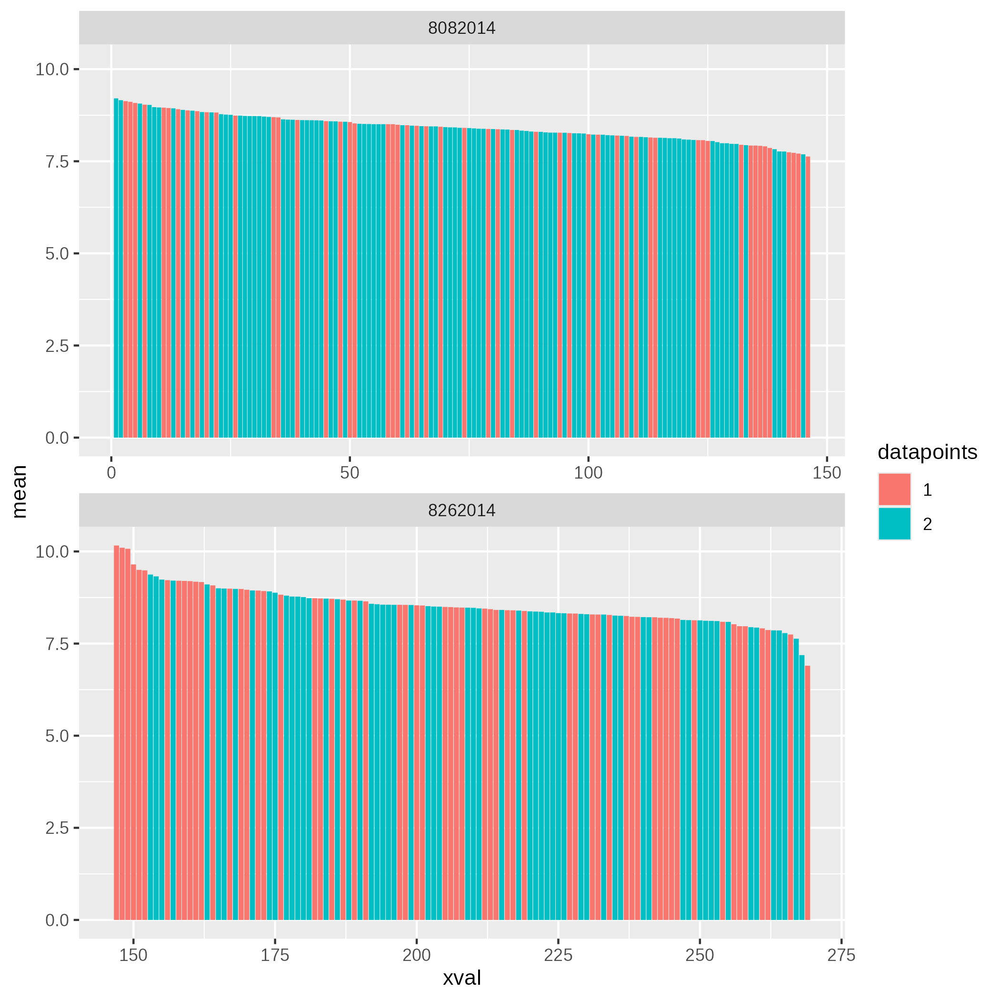
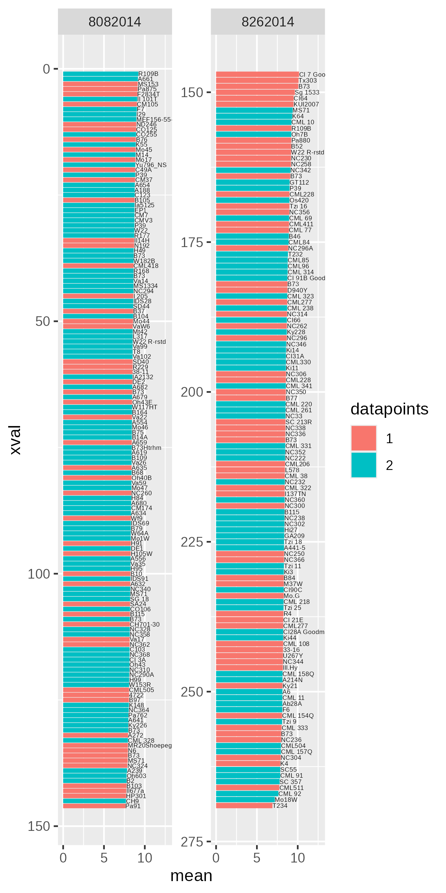

# Lab Notebook - Nitrotoluene Investigation

# Intro
I've been curious about the "Nitrotoluene Degradation" trait from my Phyllosphere GWAS paper for years, and I want to try to dig in and see if it's worth following up on.

This is a quick analysis to try to find out what's worth investing time in to get some more preliminary data

# Checks

## Stability of nitrotoluene degradation trait
First let's see how stable the trait is, specifically by comparing day vs night samples. I also want to split early versus late sampling since that might be changing things.

So from this, it looks like:

1. Log-transformed (which was what the GWAS actually used) is better
2. Day and night are reasonably well correlated
3. Aug 8 sampling (the earlier date) has stronger/more consistent signal than Aug 26

## High/low nitrotoluene lines

Okay, now to determine which lines had the highest/lowest nitrotoluene degradation signal so we can potentially plant them in Summer 2025

First, a quick overview of the spread, colored by whether we have both day and night samples, or only one of them:

Hmm...looks like **the later sampling has more spread**. Though comparing to the correlation plots, that may be due to outliers.

Here is the list of the genotypes (also saved in a CSV file)

So from this, our top 10 lines from the early sampling are:

| Line | Samples | 2017 Nursery seed |
| ---- | ---- | ---- |
| R109B | both | - (never grown?) |
| A661 | both | 271 |
| MS153 | night only | 2124 |
| Pa875 | night only | 1174 | 
| F2834T | night only | 273 |
| Il 101T | both | 141 |
| CM105 | night only | 361 |
| F7 | both | 1042 |
| I29 | both | 467 |
| MEF156-55-2 | both | 77 |

And the corresponding bottom 10 are:

| Line | Samples | 2017 Nursery seed |
| ---- | ---- | ---- |
| MS71 | night only | 1669 |
| NC324 | night only | 79 |
| A239 | both | 1680 |
| Oh603 | both | 1026 |
| B2 | both | 111 |
| B103 | night only | 236 |
| Il677a | day only | - (and generally bad) |
| HP301 | night only | 419 |
| CH9 | both | 932 |
| Pa91 | day only | 1350 |

So if I had to pick my top 5 of each:

- High: A661, MS153, Pa875, CM105, F7 (Skipping F2834T b/c slightly lower seed yield)
- Low: Pa91, CH9, HP301, Oh603, A239 (Skipping B103 b/c of slightly lower seed yield)

Unfortunately, some of these seem to be exceptionally good in 2017. Later years not so good. Do all 10 to make sure have at least 3 good ones per end?

## TODO: Determine the ultimate source of the nitrotoluene signal (=which organisms contributing to it)
