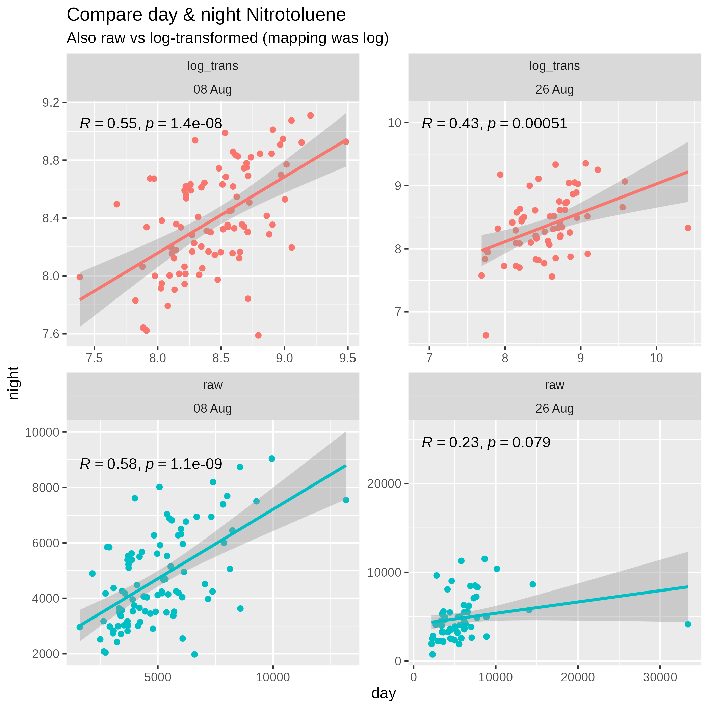

# Lab Notebook - Nitrotoluene Investigation

# Intro
I've been curious about the "Nitrotoluene Degradation" trait from my Phyllosphere GWAS paper for years, and I want to try to dig in and see if it's worth following up on.

This is a quick analysis to try to find out what's worth investing time in to get some more preliminary data

# Checks

## Stability of nitrotoluene degradation trait
First let's see how stable the trait is, specifically by comparing day vs night samples. I also want to split early versus late sampling since that might be changing things.

So from this, it looks like:

1. Log-transformed (which was waht the GWAS actually used) is better
2. Day and night are reasonably well correlated
3. Aug 8 sampling (the earlier date) has stronger/more consistent signal than Aug 26

## High/low nitrotoluene lines

Okay, now to determine which lines had the highest/lowest nitrotoluene degradation signal
